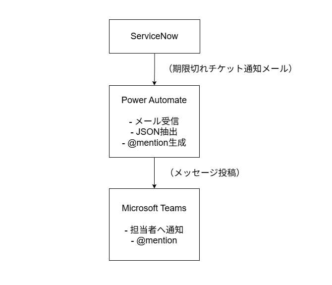

# ServiceNow期限切れチケットのTeamsメンション通知ワークフロー

## 課題

業務では ServiceNow のチケットでタスク管理を行っているが、期限切れチケットが週次ミーティングで初めて発覚する運用となっていた。日常的に各担当者がチケットを確認する習慣が定着しておらず、期限超過が常態化している点が課題であった。

## **対応方針**

ServiceNow から期限切れチケットを抽出し、Power Automate を用いて担当者へ Microsoft Teams でメンション通知することで、期限超過に気づける仕組みを構築することとした。

## 本仕組みの特長

本仕組みの最大のメリットは、Power Automate の Premium コネクタを使用せずに実現できる点である。Power Automate では Premium ライセンスを使用することで ServiceNow と直接連携できるが、本構成では ServiceNow から送信されるメールを起点とすることで、Standard コネクタのみを用いた実装を可能としている。

これにより、追加コストを発生させることなく、ServiceNow の期限切れチケットをトリガーとした Teams 通知を実現できる。

## この記事で分かること

- ServiceNow で期限切れチケットを抽出し、メール通知する方法
- Power Automate を用いてメール本文から JSON データを抽出する手法
- 抽出した情報をもとに、Microsoft Teams で担当者をメンションして通知する方法
- Premium コネクタを使用せずに ServiceNow と連携する構成の考え方

## 前提条件

- ServiceNow の利用環境があり、チケット（Incident 等）を管理していること
    - チケットに期限（Due date）が設定されていること
    - ServiceNow からメール通知を送信できる設定が行われていること
- Power Automate を利用できる Microsoft 365 環境があること
- Microsoft Teams を業務で利用していること

## 全体構成

全体構成図は以下の通りである。
ServiceNow で期限切れチケットを検出し、通知メールを送信する。Power Automate はそのメールを起点として内容を整形し、Microsoft Teams 上で担当者へ通知を行う構成としている。

本構成のポイントは、ServiceNow と Power Automate を直接連携させず、メールを中継点としている点にある。これにより、Power Automate の Premium コネクタを使用することなく、Standard コネクタのみで実装が可能。

業務環境においては、Premium コネクタが利用可能なアカウントは必ずしも用意されていないケースが多く、本構成はそのような制約下でも現実的に採用しやすい方式である。

## ドキュメント構成

今回は記事が長くなるため、カテゴリごとに分割している。詳細は以下を参照。

1. ServiceNow 側の設定: `servicenow/setup.md`
2. Power Automate フロー: `power-automate/flow.md`
