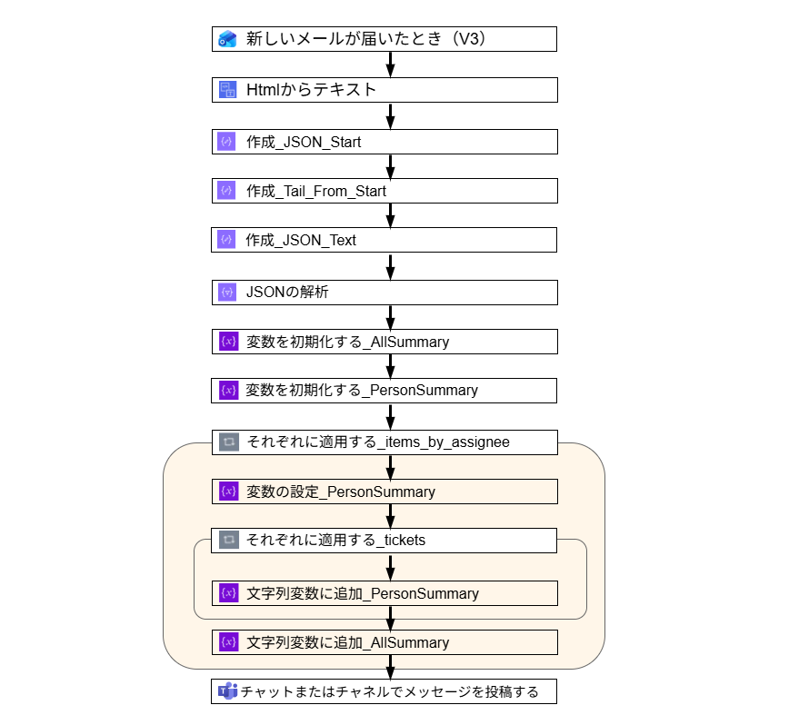

# Power Automate フロー

## はじめに

ServiceNow の設定が完了していると、特定の時間に期限切れチケットを通知するメールが、自身のメールボックスに届くはずである。

続く設定では、そのメールを Power Automate が検知し、期限切れチケットを担当者ごとに通知する仕組みを構築する。ただし、今回は Power Automate を利用できる検証用環境を用意していない。個人環境では Microsoft 365 の契約形態によって Power Automate の利用可否や機能に制約が生じる場合があるため、実際に検証を行う際は、利用可能な環境での実機確認を推奨する。

また、今回は開発環境も使用できないため、不要な情報はマスクしたうえで、可能な限り再現できるように記載する。

## 構成図

全体の構成は以下のとおりである。
アクション名は原則としてデフォルトの名称を使用している。ただし、同一アクションを複数使用する場合は区別のため名称を変更している（例：「作成」など）。



全体の流れは以下のとおりである。

まず ServiceNow から送信されたメールを受信し、その本文を 「HTML からテキスト」 アクションを使用して整形する。

次に、本文中の JSON は {"notification" という文字列から始まるため、そこから末尾までを抽出する。

その後、AllSummary と PersonSummary の 2 つの変数を用意し、「それぞれに適用する」 を使用してチケットを抽出する。
最後に、AllSummary に集約した内容を Teams に投稿する構成である。

## 作成手順

以下では、構成図の上から順にアクションの設定内容を記載する。

### 新しいメールが届いたとき（V3）

- 件名フィルター : `Expired Ticket Notification`

前の記事で作成した[Notification] → [What it will contain]で設定した件名である。この件名のメールを受信した場合にフローが発火する。

### Htmlからテキスト

コンテンツには下記を指定する。

ただし、直接式を入力するのではなく、関数ボタンをクリックして[動的コンテンツ] → [新しいメールが届いたとき（V3）] → [本文]を選択する方法を推奨する。この方法であれば記述ミスを防ぐことができるからである。

```scss
triggerOutputs()?['body/body']
```

### 作成_JSON_Start（アクション名は「作成」）

パラメーターには以下を指定する。

```scss
indexOf(body('Html_からテキスト'),'{"notification"')
```

### 作成_Tail_From_Start（アクション名は「作成」）

パラメーターには以下を指定する。

```scss
substring(
	body('Html_からテキスト'),
	outputs('作成_JSON_Start'),
	sub(length(body('Html_からテキスト')),outputs('作成_JSON_Start'))
	)
```

### 作成_JSON_Text（アクション名は「作成」）

パラメーターには以下を指定する。

```scss
substring(
	outputs('作成_Tail_From_Start'),
	0,
	add(lastIndexOf(outputs('作成_Tail_From_Start'),'}'),1)
)
```

### JSONの解析

以下の設定値を入力する

- Content  : `outputs('作成_JSON_TEXT')`

Schemaは以下。このアクションはJSON文字列を Power Automate が項目名で参照できるデータにするために使用する。

```json
{
  "type": "object",
  "properties": {
    "notification": {
      "type": "string"
    },
    "group": {
      "type": "string"
    },
    "generated_at": {
      "type": "string"
    },
    "table": {
      "type": "string"
    },
    "total": {
      "type": "integer"
    },
    "items_by_assignee": {
      "type": "array",
      "items": {
        "type": "object",
        "properties": {
          "assignee_sys_id": {
            "type": "string"
          },
          "assignee_display": {
            "type": "string"
          },
          "assignee_email": {
            "type": "string"
          },
          "tickets": {
            "type": "array",
            "items": {
              "type": "object",
              "properties": {
                "number": {
                  "type": "string"
                },
                "due_date": {
                  "type": "string"
                },
                "short_description": {
                  "type": "string"
                }
              },
              "required": [
                "number",
                "due_date",
                "short_description"
              ]
            }
          }
        },
        "required": [
          "assignee_display",
          "tickets"
        ]
      }
    }
  },
  "required": [
    "items_by_assignee"
  ]
}

```

### 変数を初期化する_AllSummary

以下の設定値を入力する

- 名前 : `AllSummary`
- タイプ：文字列
- 値：（空白）

### 変数を初期化する_PersonSummary

以下の設定値を入力する

- 名前 : `PersonSummary`
- タイプ：文字列
- 値：（空白）

### それぞれに適用する_items_by_assignee

「前のステップから出力を選択します」には以下の設定値を入力する

```scss
body('JSON_の解析')['items_by_assignee']
```

### 変数の設定_PersonSummary

以下の設定値を入力する

- 名前 : `PersonSummary`

値には以下を入力する。

```scss
concat(
	'<at>',
	item('それぞれに適用する_items_by_assignee')?['assignee_display'],
	'</at>',
	'さん',
	decodeUriComponent('%0A')
)
```

### それぞれに適用する_tickets

「前のステップから出力を選択します」には以下の設定値を入力する。

```scss
item('それぞれに適用する_items_by_assignee')?['tickets']
```

### 文字列変数に追加_PersonSummary

以下の設定値を入力する

- 名前 : `PersonSummary`

値には以下を入力する。

```scss
concat(
	item('それぞれに適用する_tickets')?['number'],
	'      ',
	replace(item('それぞれに適用する_tickets')?['short_description'],	decodeUriComponent('%0A'),' '),
	decodeUriComponent('%0A')
	)
```

### 文字列変数に追加_AllSummary

以下の設定値を入力する

- 名前 : All`Summary`

値には以下を入力する。

```scss
concat(
	variables('PersonSummary'),
	decodeUriComponent('%0A')
	)
```

### チャットまたはチャネルでメッセージを投稿する

以下の設定値を入力する

- 投稿者：＜任意＞
- 投稿先：＜任意＞
- グループチャット：＜任意＞

メッセージには以下を入力する。

```scss
concat(
	'本日がDueまたはDue切れのチケットです',
	<br><br>,
	trim(
		replace(
			replace(
				variables('AllSummary'),
				decodeUriComponent('%0A')
				''
			),
			decodeUriComponent('%0A'),
			'<br>'
		)
	)
)
```

以上で完了である。実際にServiceNowからメールを発出して挙動を確かめよう。
