# ServiceNow設定

## はじめに

本手順では、起点となる期限切れのインシデントチケットを作成し、それをトリガーとして通知を送信する仕組みを構築する。

以下は ServiceNow Developer 環境を前提としている。Developer 環境では外部宛てのメール送信ができないため、本手順ではメール送信直前までの動作確認を行う。

全体の構成および作業の流れは以下のとおりである。

1. Incident チケット作成
2. Event Registration
3. Notification
4. Notification Email Scripts
5. Scheduled Jobs

## Incident ticket作成

まず、検証用のサンプル Incident チケットを作成する。

※チケット作成には Admin 権限が必要である。ServiceNow はアカウント単位・権限単位で課金されるため、業務環境で実施する場合は事前に管理者へ確認すること。

本手順では Developer 環境を使用する。チケットの具体的な作成手順は一般的な内容であり、詳細は割愛する。

以下の条件で 4 件の Incident チケットを作成する。

- うち 1 件のみ state を Resolved とする
    - 後続のフィルタ条件で除外されることを確認するため
- Due Date はすべて 過去日付とする
- Assignment Group は Service Desk
- Assigned to は Beth Anglin および David Loo とする

チケット作成直後は以下のような状態になる。

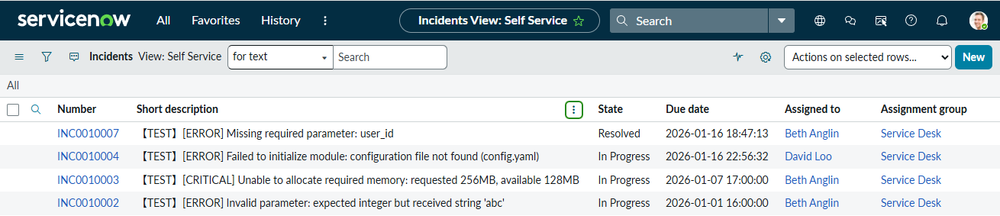

チケット作成後、期限切れチケットが正しく抽出されるかを確認する。以下の赤枠の条件で検索し、**3 件のチケットのみが表示され、**先ほど Resolved としたチケットが表示されないことを確認すること。

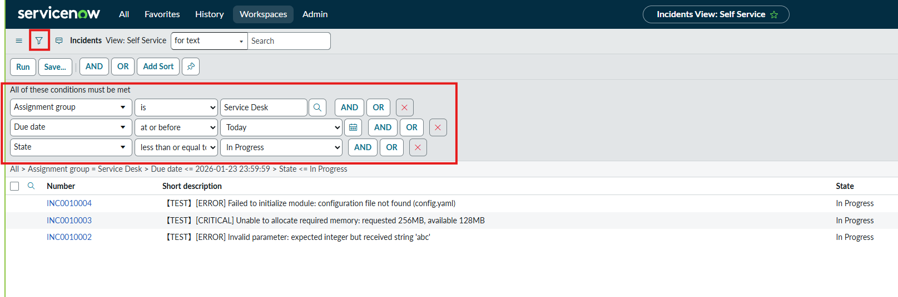

なお、state の条件は**“in progress less than or equal to”**となっているが、state は内部的には **整数値**として管理されていることに注意。state の数値定義は、インシデントチケットで state フィールドを右クリックし **[**Show Choice List**]** を選択することで確認できる。

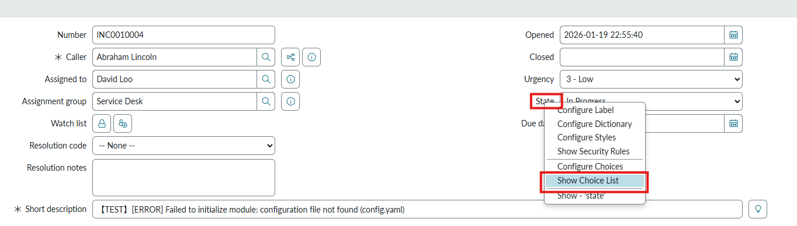

表示された一覧から、各ラベルに対応する value を確認可能である。

Developer 環境では「In Progress」が 2、「Resolved 」が 6と定義されている。そのため、「state ≤ 2」とすることで Resolved を除外している。


## Event Registration

次に Event Registration を作成する。[System Policy] → [Events] → [Registry] を開き、新規に Event Registry を登録する。

- Event name : ticket.expired.notify

このイベント名は後続の Notification および Scheduled Job で使用する。

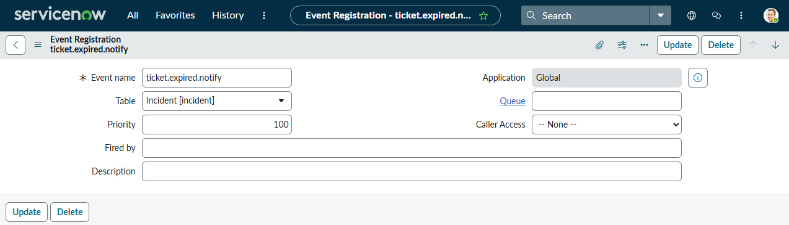

## Notification

続いて Notification を作成する。[System Notification] → [Email] → [Notifications] を選択し、右上の [New] をクリックする。

- Name : Expired Ticket Notification
- その他の設定値は画像のとおりとする

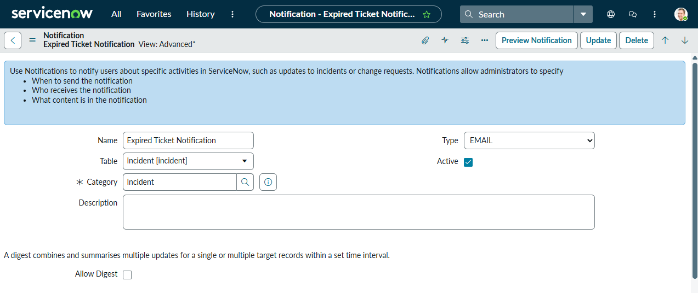

画面下部には、[When to send]、[Who will receive]、[What it will contain]という三つのタブが存在し、それぞれ以下の内容を設定する。

### When to send

- Send When : Event is fired
- Event name : `ticket.expired.notify`

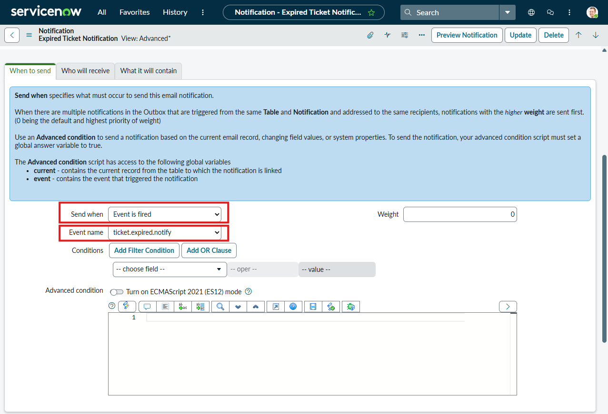

### Who will receive

Users は任意で設定してよいが、業務環境では自身を指定する想定である。また、Developer 環境では実際にメールは送信されないため、任意のユーザーで問題ない。

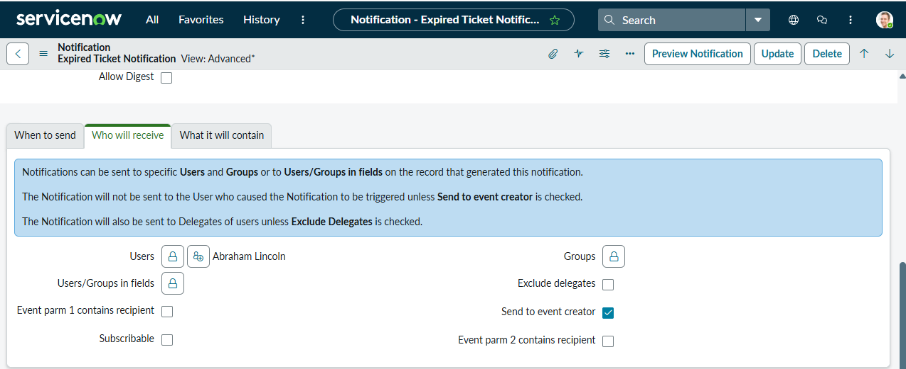

### What it will contain

- Subject : `Expired Ticket Notification`

Message HTML には以下を入力する。

```bash
${mail_script:List overdue Service Desk tasks}
```

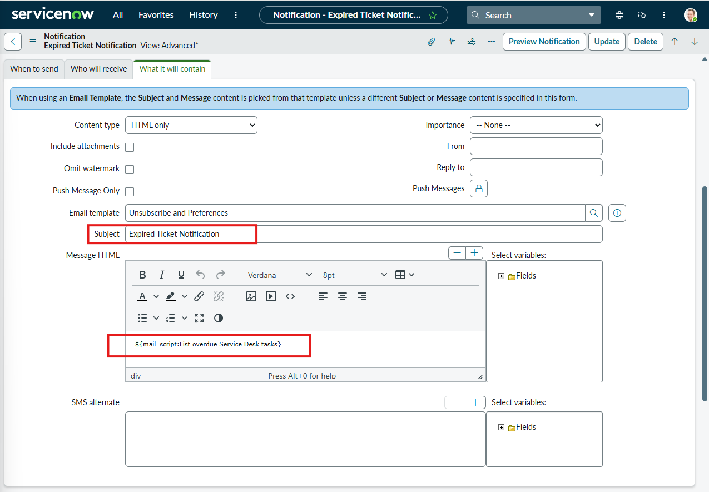

## Notification Email Scripts

次に Notification Email Script を作成する。[System Notification] → [Email] → [Notification Email Scripts] を選択し、右上の [New] をクリックする。

- Name : `List overdue Service Desk tasks`

Script には以下を記述する。

```jsx

(function runMailScript(current, template, email, email_action, event) {

  var tableName = 'incident';
  var groupName = 'Service Desk';
  var maxRows  = 100;

  var gr = new GlideRecord(tableName);
  if (!gr.isValid()) {
    template.print('<p style="color:#c00;">Invalid table: ' + tableName + '</p>');
    return;
  }
  gr.addQuery('assignment_group.name', groupName);
  gr.addQuery('due_date', '<=', gs.endOfToday());
  gr.addQuery('state', '<=', 2);
  gr.orderBy('due_date');
  gr.setLimit(maxRows + 1);
  gr.query();

  var base = gs.getProperty('glide.servlet.uri') || '';
  var html = [];
  html.push('<div style="font-family:Segoe UI, Arial, Helvetica, sans-serif;">');
  html.push('<h3>期限切れ（Due date &lt; 今日）のService Deskチケット一覧</h3>');
  html.push('<table border="1" cellpadding="4" cellspacing="0" style="border-collapse:collapse;">',
            '<thead><tr>',
            '<th>Number</th><th>Short description</th><th>Assigned to</th><th>Due date</th>',
            '</tr></thead><tbody>');

  // --- 機械向けデータ（担当者ごとのチケット）を構築 ---
  var byAssignee = {}; // key: assignee sys_id（なければ 'unassigned'）
  var total = 0;

  while (gr.next()) {
    total++;
    if (total <= maxRows) {
      var link = base + gr.getLink(true);
      html.push('<tr>',
                '<td><a href="', link, '">', gr.getValue('number') || gr.getDisplayValue('sys_id'), '</a></td>',
                '<td>', GlideStringUtil.escapeHTML(gr.getDisplayValue('short_description') || ''), '</td>',
                '<td>', GlideStringUtil.escapeHTML(gr.getDisplayValue('assigned_to') || 'Unassigned'), '</td>',
                '<td>', GlideStringUtil.escapeHTML(gr.getDisplayValue('due_date') || ''), '</td>',
                '</tr>');
    }

    // JSON 用の蓄積
    var assigneeId = gr.getValue('assigned_to') || 'unassigned';
    if (!byAssignee[assigneeId]) {
      // 参照先ユーザー（メールが必要）
      var name = gr.getDisplayValue('assigned_to') || 'Unassigned';
      var emailAddr = '';
      if (assigneeId !== 'unassigned') {
        var u = new GlideRecord('sys_user');
        if (u.get(assigneeId)) {
          emailAddr = u.getValue('email') || '';
        }
      }
      byAssignee[assigneeId] = {
        assignee_sys_id: assigneeId,
        assignee_display: name,
        assignee_email: emailAddr,
        tickets: []
      };
    }
    byAssignee[assigneeId].tickets.push({
      number: gr.getValue('number'),
      due_date: gr.getDisplayValue('due_date') || '',
      short_description: gr.getDisplayValue('short_description') || ''
    });
  }

  if (total === 0) {
    html.push('<tr><td colspan="4">該当チケットはありません。</td></tr>');
  }
  html.push('</tbody></table>');
  if (total > maxRows) {
    html.push('<p style="color:#666;font-size:12px;">※ ', maxRows, '件まで表示。さらに多くのレコードがあります。</p>');
  }
  html.push('</div>');

  // --- JSON を生成（機械向け）。マーカーで囲って本文末尾に埋め込む ---
  var items = [];
  for (var k in byAssignee) {
    if (byAssignee.hasOwnProperty(k)) items.push(byAssignee[k]);
  }
  var payload = {
    notification: 'overdue_list_v1',
    group: groupName,
    generated_at: gs.nowDateTime(), // UTC（例: 2026-01-21 01:10:00）
    table: tableName,
    total: total,
    items_by_assignee: items
  };
  var json = JSON.stringify(payload);

  html.push('<!--SN_JSON_BEGIN-->', json, '<!--SN_JSON_END-->');

  template.print(html.join(''));

})(current, template, email, email_action, event);

```

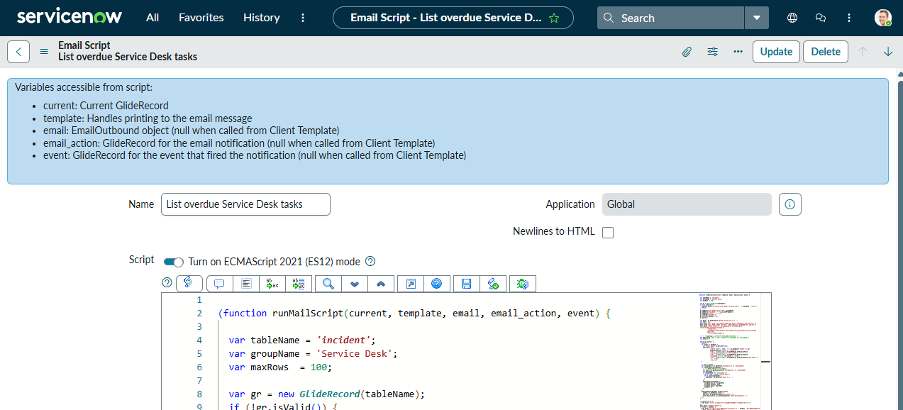

## Scheduled Jobs

最後に Scheduled Job を作成する。[System Definition] → [Scheduled Jobs] を選択し、[New] をクリックする。

- Name : `Send Expired Ticket Notification`
- Run や Timezone を適宜設定する
    - Developer 環境では日本の Timezone を選択できない点に注意

このスケジュールを実行することで、指定時刻にイベントを発火させることが可能となる。

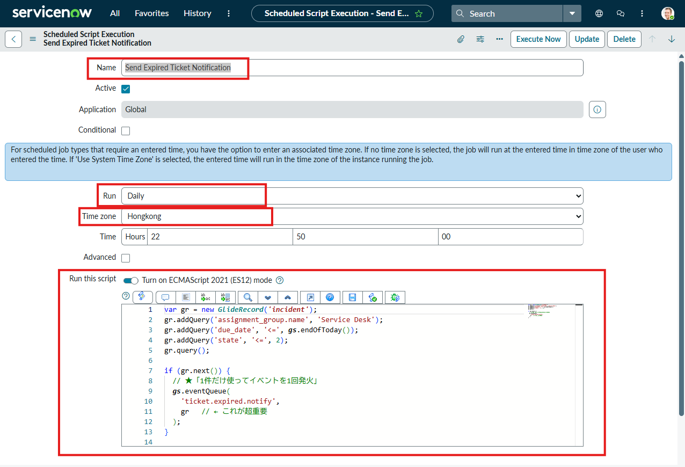

Script には以下を記述する。

```jsx
var gr = new GlideRecord('incident');
gr.addQuery('assignment_group.name', 'Service Desk');
gr.addQuery('due_date', '<=', gs.endOfToday());
gr.addQuery('state', '<=', 2);
gr.query();

if (gr.next()) {
  // ★「1件だけ使ってイベントを1回発火」
  gs.eventQueue(
    'ticket.expired.notify',
    gr   
  );
}
```

設定後、画面下部の [Execute Now] を実行する。実行後、処理が正常に完了すれば成功である。
（ただし、Developer 環境では外部へのメール送信は行われない。）

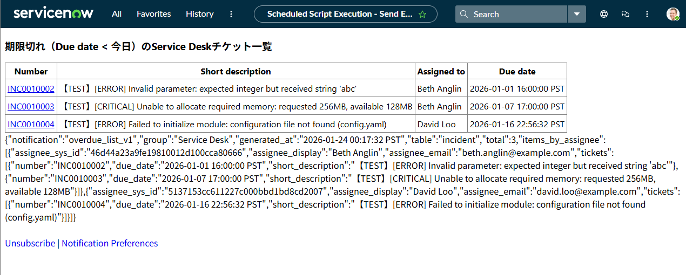

以上でServiceNowの設定は完了となる。
