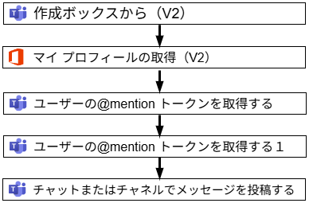
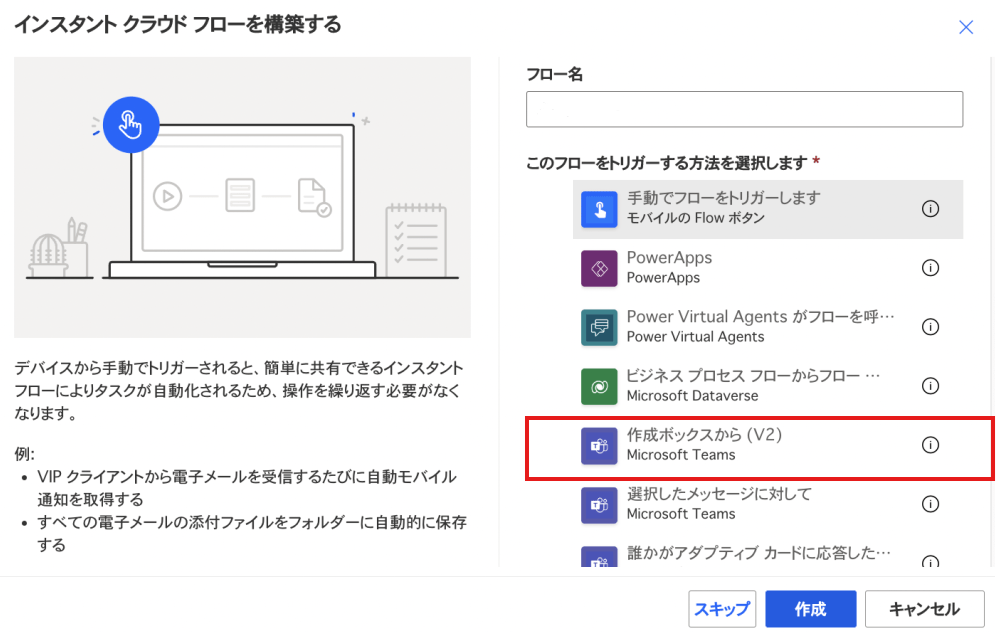
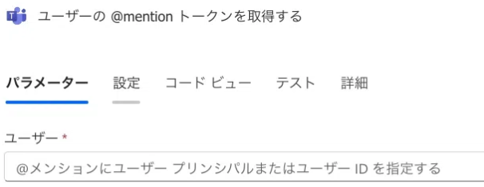
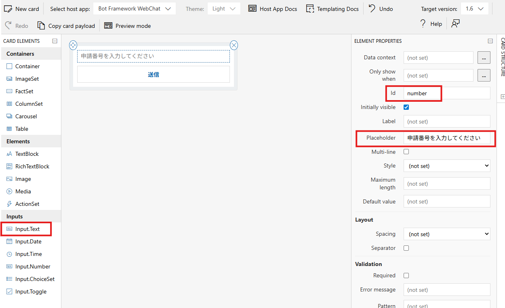
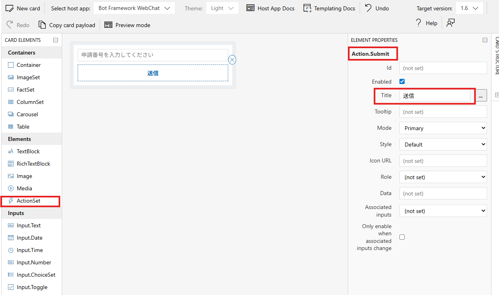

# Teams 承認依頼投稿の @mention 自動化（Power Automate）

## 課題

ある特定のサーバにログインする際、事前に承認が必要な運用となっており、承認依頼を Microsoft Teams に投稿する必要があった。その際、以下のような投稿文を毎回手入力していた。

```
@Aさん @Bさん @Cさん  @Dさん
＜自分の名前＞です。＜申請番号＞の承認をお願いします。
```

この投稿は 1 日に複数回行うことがあり、複数名への @mention を毎回手で入力する作業が負担となっていた。

## 対応方針

承認依頼投稿を定型化し、複数名への @mention を含むメッセージを自動生成することで、手入力による作業負荷と入力ミスを削減する。
Microsoft Teams 上で @mention を正しく機能させる必要があるため、Teams とネイティブに連携可能な Power Automate を用いた自動化を採用した。


## 前提条件

- 組織の Teams 環境であること（複数ユーザーへの @mention を行うため）
- Microsoft Teams が利用可能であること
- Power Automate が利用可能であること

## 注意事項（再現方法について）

本フローは、Power Automate の GUI を用いて手動で構築している。

- 業務環境で構築したフローは持ち出せないため、JSON のエクスポートは行っていない。
- JSON にはテナント固有のパラメータが多く含まれ、マスキングコストが高いため、本記事では GUI による再作成を選択している。
- 掲載している画像は、あくまで構成理解のための参考である。

## 構成図

構成は非常に単純で下図を参照のこと。また、メンション先の人数は「ユーザーの＠mention トークンを取得する」の数と一致する。（今回は特定の2人にメンションを想定しているため、同じアクションが二つある）。また、画像のアクション名はわかりやすさを考慮し名前の変更は加えていない。



## 手順

ブラウザで Power Automate を開き、［作成］から［インスタント クラウド フロー］を選択する。フロー名を入力し、トリガーとして［作成ボックスから（V2）］を選択する。



フロー編集画面で「＋」を押し、アクションを追加する。最初に追加するのは［マイ プロフィールの取得（V2）］である。このアクションには、特にパラメータを入力する必要はない。

次に、［ユーザーの @mention トークンを取得する］アクションを選択し、メンションしたいユーザーのメールアドレスを指定する。



最後に、［チャットまたはチャネルでメッセージを投稿する］アクションを検索して選択し、必要なパラメータを入力する。

グループチャットについては、動作確認が完了するまでは仮のもの（誰かと作成したチャット）で問題ない。メッセージ欄には、いったんテスト用の文字列を入力して保存する。

## ポイント

ここで一度フローを保存することが重要である。保存を行わないと、後続でメッセージに動的パラメータを埋め込むことができない（一度でフローを完成させようとすると失敗する）。また、保存後にトリガー名が［作成ボックスから］から manual に自動的に変更されることに注意。

## メッセージ
保存が完了したら［チャットまたはチャネルでメッセージを投稿する］のメッセージ欄を以下のように修正する。
構文の詳細な意味については解説しないが、見るだけでも何となく理解できると思う。

```
@{outputs('ユーザーの_@mention_トークンを取得する')?['body/atMention']}さん、@{outputs('ユーザーの_@mention_トークンを取得する１')?['body/atMention']}さん

@{body('マイ_プロフィールの取得_(V2)')?['surname']}です。
番号:@{triggerBody()?['cardOutputs']?['number']}の承認お願いします。
```


最後の`@{triggerBody()?['cardOutputs']?['number']}`の値は、［作成ボックスから（V2）］（現在は名前が `manual` に変更されている）で入力した値を取得している。この `number` というキーは、Adaptive Card の設定における **id 欄**と一致させる必要がある。

以下は、Adaptive Card Designer 上での設定例である。値を入力したのは[id]と[Placeholder]欄である。
画像は下記のリンクから作成したもの。

[https://adaptivecards.io/designer/](https://adaptivecards.io/designer/)




また送信ボタンは以下のように作成する



どの項目がどの値と紐づいているか分かりにくい場合は、**メッセージを完成させる前に一度テストを実行して確認するのがよい**。

テスト結果は Power Automate の実行履歴から確認できる。例えば、現在は自分の名前を以下のように取得している。

```
@{body('マイ_プロフィールの取得_(V2)')?['surname']}です。
```

これは、［マイ プロフィールの取得（V2）］アクションの実行結果に含まれる `body` ブロックのうち、`surname` フィールドの値を抜き出しているだけである。

そのため、フルネームを表示したい場合は、同じ `body` 内の `displayName` フィールドを指定すればよい。

自分の作成したworkflowが問題なく動くことを確認したら、［チャットまたはチャネルでメッセージを投稿する］アクションの適用先を変更し、完成である。
